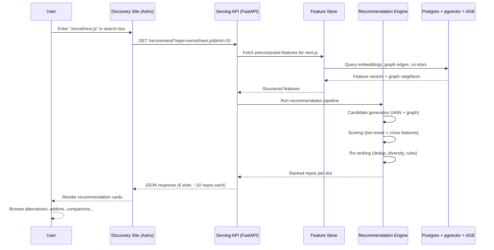
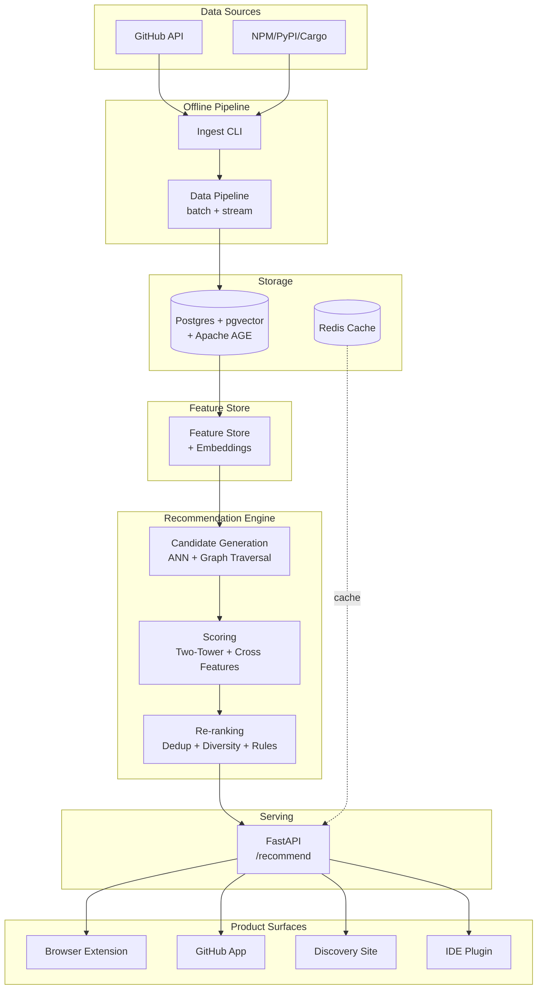
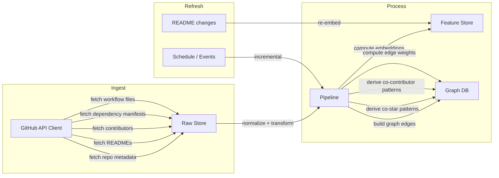
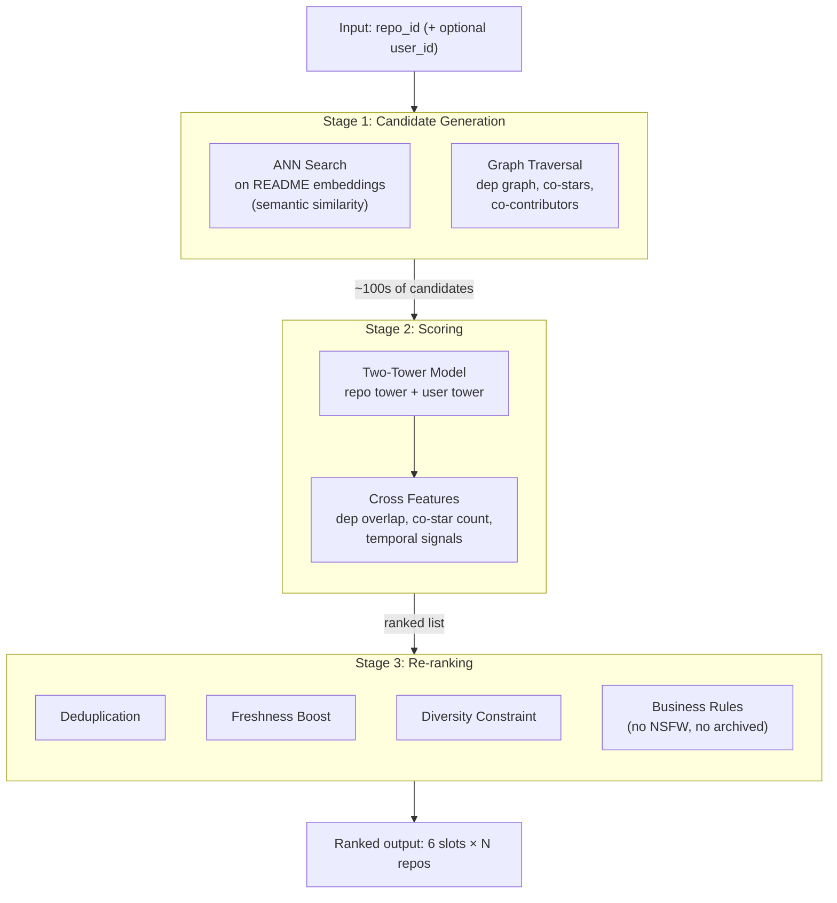
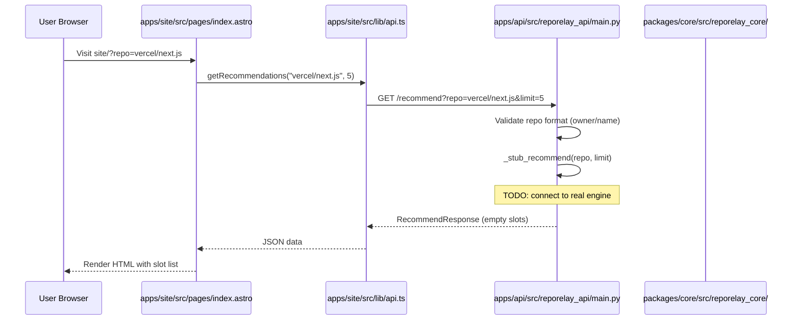
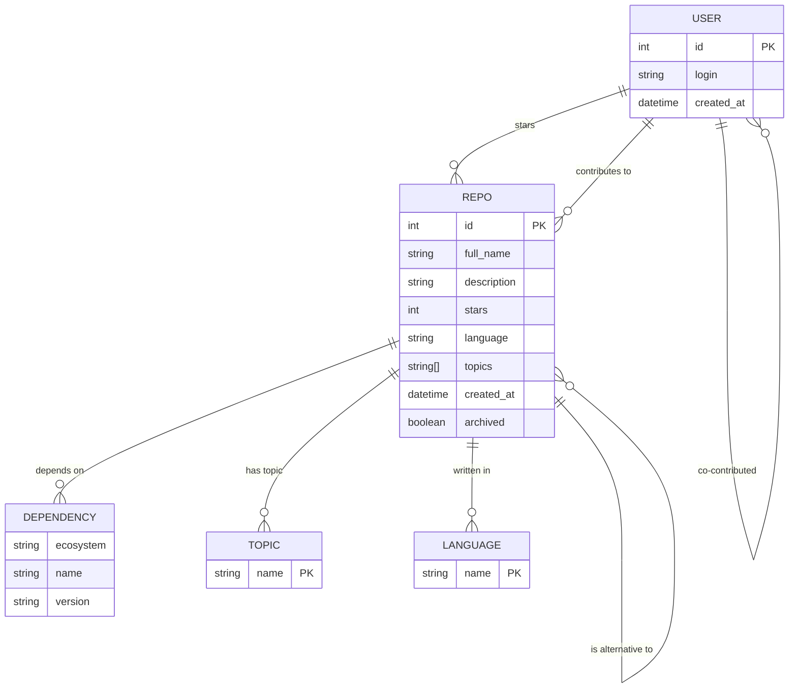

# 08 — User Flow Diagrams

Visual trace of what happens when someone uses RepoRelay. Each diagram is shown in Mermaid (renders in GitHub/docs) and ASCII (works everywhere).

---

## 1. End-to-End User Journey

What the user does, and what happens behind the scenes at each step.

### Mermaid



### ASCII

```
 USER                  SITE (Astro)              API (FastAPI)         FEATURE STORE         ENGINE              DB
  │                        │                         │                     │                    │                  │
  │  1. Enter repo name    │                         │                     │                    │                  │
  │───────────────────────>│                         │                     │                    │                  │
  │                        │  2. GET /recommend       │                     │                    │                  │
  │                        │────────────────────────>│                     │                    │                  │
  │                        │                         │  3. Fetch features  │                    │                  │
  │                        │                         │────────────────────>│                    │                  │
  │                        │                         │                     │  4. Query DB       │                  │
  │                        │                         │                     │──────────────────────────────────────>│
  │                        │                         │                     │                    │                  │
  │                        │                         │                     │  5. Return features│                  │
  │                        │                         │                     │<──────────────────────────────────────│
  │                        │                         │  6. Features ready  │                    │                  │
  │                        │                         │<────────────────────│                    │                  │
  │                        │                         │                     │                    │                  │
  │                        │                         │  7. Run pipeline    │                    │                  │
  │                        │                         │─────────────────────────────────────────>│                  │
  │                        │                         │                     │                    │                  │
  │                        │                         │                     │  8. Ranked results │                  │
  │                        │                         │<─────────────────────────────────────────│                  │
  │                        │  9. JSON response       │                     │                    │                  │
  │                        │<────────────────────────│                     │                    │                  │
  │  10. Render cards      │                         │                     │                    │                  │
  │<───────────────────────│                         │                     │                    │                  │
  │                        │                         │                     │                    │                  │
```

---

## 2. System Architecture

All components and how they wire together.

### Mermaid



### ASCII

```
 ┌─────────────────────────────────────────────────────────────────────┐
 │                         DATA SOURCES                                │
 │   ┌──────────┐    ┌──────────┐    ┌──────────┐    ┌──────────┐    │
 │   │ GitHub   │    │ NPM      │    │ PyPI     │    │ Cargo    │    │
 │   │ API      │    │ Registry │    │ Registry │    │ Registry │    │
 │   └────┬─────┘    └────┬─────┘    └────┬─────┘    └────┬─────┘    │
 └────────┼───────────────┼───────────────┼───────────────┼───────────┘
          │               │               │               │
          ▼               ▼               ▼               ▼
 ┌─────────────────────────────────────────────────────────────────────┐
 │                      OFFLINE PIPELINE                               │
 │   ┌──────────────────────────────────────────────────────────┐     │
 │   │  Ingest CLI  ──▶  Data Pipeline (batch + stream)         │     │
 │   └──────────────────────────┬───────────────────────────────┘     │
 └──────────────────────────────┼──────────────────────────────────────┘
                                │
                                ▼
 ┌─────────────────────────────────────────────────────────────────────┐
 │                          STORAGE                                    │
 │   ┌──────────────────────┐        ┌──────────────────────┐        │
 │   │ Postgres + pgvector  │        │ Redis                │        │
 │   │ + Apache AGE         │        │ (cache)              │        │
 │   │ (raw + graph + vecs) │        └──────────┬───────────┘        │
 │   └──────────┬───────────┘                   │                     │
 └──────────────┼───────────────────────────────┼─────────────────────┘
                │                               │
                ▼                               │
 ┌──────────────────────────────┐               │
 │       FEATURE STORE          │               │
 │  (embeddings + precomputed   │               │
 │   graph features)            │               │
 └──────────┬───────────────────┘               │
            │                                   │
            ▼                                   │
 ┌──────────────────────────────────────────────┼─────────────────────┐
 │            RECOMMENDATION ENGINE             │                     │
 │   ┌─────────────────┐                        │                     │
 │   │ Candidate Gen   │ ANN + graph traversal  │                     │
 │   └────────┬────────┘                        │                     │
 │            ▼                                 │                     │
 │   ┌─────────────────┐                        │                     │
 │   │ Scoring         │ Two-tower + cross feat │                     │
 │   └────────┬────────┘                        │                     │
 │            ▼                                 │                     │
 │   ┌─────────────────┐                        │                     │
 │   │ Re-ranking      │ Dedup + diversity      │                     │
 │   └────────┬────────┘                        │                     │
 └────────────┼─────────────────────────────────┼─────────────────────┘
              │                                 │
              ▼                                 │
 ┌──────────────────────────────────────────────┼─────────────────────┐
 │              SERVING API                     │                     │
 │   ┌──────────────────────────────────────────┴───────────────┐    │
 │   │  FastAPI   GET /recommend?repo=owner/name&limit=10       │    │
 │   │  < 150ms p99                                              │    │
 │   └──────────────────────────┬────────────────────────────────┘    │
 └──────────────────────────────┼─────────────────────────────────────┘
                                │
          ┌─────────────┬───────┴───────┬─────────────┐
          ▼             ▼               ▼             ▼
 ┌────────────┐ ┌────────────┐ ┌────────────┐ ┌────────────┐
 │  Browser   │ │  GitHub    │ │ Discovery  │ │    IDE     │
 │ Extension  │ │   App      │ │   Site     │ │   Plugin   │
 └────────────┘ └────────────┘ └────────────┘ └────────────┘
```

---

## 3. Data Pipeline Flow

How raw GitHub data gets ingested, processed, and stored.

### Mermaid



### ASCII

```
 ┌─────────────────────────────────────────────────────────────────────┐
 │                          INGEST                                     │
 │                                                                     │
 │   GitHub API Client                                                │
 │   ├── fetch repo metadata ──────────▶ Raw Store (Postgres)         │
 │   ├── fetch READMEs ────────────────▶ Raw Store                    │
 │   ├── fetch contributors ───────────▶ Raw Store                    │
 │   ├── fetch dependency manifests ───▶ Raw Store                    │
 │   └── fetch workflow files ─────────▶ Raw Store                    │
 │                                                                     │
 └──────────────────────────────┬──────────────────────────────────────┘
                                │
                                ▼
 ┌─────────────────────────────────────────────────────────────────────┐
 │                          PROCESS                                    │
 │                                                                     │
 │   Raw Store ──▶ Pipeline (normalize + transform)                   │
 │                  │                                                  │
 │                  ├──▶ compute embeddings ──▶ Feature Store          │
 │                  ├──▶ build graph edges ──▶ Graph DB (AGE)         │
 │                  ├──▶ derive co-star patterns ──▶ Graph DB          │
 │                  ├──▶ derive co-contributor patterns ──▶ Graph DB   │
 │                  └──▶ compute edge weights ──▶ Graph DB             │
 │                                                                     │
 └──────────────────────────────┬──────────────────────────────────────┘
                                │
                                ▼
 ┌─────────────────────────────────────────────────────────────────────┐
 │                         REFRESH                                     │
 │                                                                     │
 │   Schedule / Events ──▶ incremental pipeline updates               │
 │   README changes ──▶ re-embed into Feature Store                   │
 │                                                                     │
 │   Target: model staleness < 6 hours                                │
 │                                                                     │
 └─────────────────────────────────────────────────────────────────────┘
```

---

## 4. Recommendation Engine Funnel

The 3-stage ML pipeline that turns millions of repos into ranked results.

### Mermaid



### ASCII

```
 ┌─────────────────────────────────────────────────────────────────────┐
 │  INPUT: repo_id (owner/name), optional user_id, context            │
 └──────────────────────────────┬──────────────────────────────────────┘
                                │
                                ▼
 ┌─────────────────────────────────────────────────────────────────────┐
 │  STAGE 1: CANDIDATE GENERATION                                     │
 │  ┌──────────────────────────┐  ┌──────────────────────────┐       │
 │  │ ANN Search               │  │ Graph Traversal           │       │
 │  │ on README embeddings     │  │ dep graph, co-stars,      │       │
 │  │ (semantic similarity)    │  │ co-contributors           │       │
 │  └──────────────┬───────────┘  └──────────────┬────────────┘       │
 │                 └──────────────┬──────────────┘                     │
 └────────────────────────────────┼────────────────────────────────────┘
                                  │
                                  │  ~100s of candidates
                                  ▼
 ┌─────────────────────────────────────────────────────────────────────┐
 │  STAGE 2: SCORING                                                   │
 │  ┌──────────────────────────┐  ┌──────────────────────────┐       │
 │  │ Two-Tower Model          │  │ Cross Features            │       │
 │  │ repo tower + user tower  │──│ dep overlap, co-star      │       │
 │  │                          │  │ count, temporal signals   │       │
 │  └──────────────────────────┘  └──────────────────────────┘       │
 └──────────────────────────────┬──────────────────────────────────────┘
                                │
                                │  ranked list
                                ▼
 ┌─────────────────────────────────────────────────────────────────────┐
 │  STAGE 3: RE-RANKING                                                │
 │  ┌──────────┐ ┌──────────┐ ┌──────────┐ ┌──────────┐             │
 │  │ Dedup    │ │ Freshness│ │ Diversity│ │ Business │             │
 │  │          │ │ Boost    │ │          │ │ Rules    │             │
 │  └──────────┘ └──────────┘ └──────────┘ └──────────┘             │
 └──────────────────────────────┬──────────────────────────────────────┘
                                │
                                ▼
 ┌─────────────────────────────────────────────────────────────────────┐
 │  OUTPUT: 6 slots × N ranked repos                                   │
 │  ┌────────────┬──────────┬───────────┬──────────┬─────────┬─────┐ │
 │  │Alternatives│ Addons   │Companions │ Starters │Trending │Maint│ │
 │  └────────────┴──────────┴───────────┴──────────┴─────────┴─────┘ │
 └─────────────────────────────────────────────────────────────────────┘
```

---

## 5. Request/Response Trace

Exact code path from a user's browser action to the API response.

### Mermaid



### ASCII

```
 USER BROWSER                SITE                          API
      │                       │                             │
      │  1. Visit             │                             │
      │  site/?repo=          │                             │
      │  vercel/next.js       │                             │
      │──────────────────────>│                             │
      │                       │  2. getRecommendations()    │
      │                       │  (from lib/api.ts)          │
      │                       │                             │
      │                       │  3. GET /recommend?         │
      │                       │  repo=vercel/next.js        │
      │                       │  &limit=5                   │
      │                       │────────────────────────────>│
      │                       │                             │
      │                       │     4. Validate format      │
      │                       │     (owner/name check)      │
      │                       │                             │
      │                       │     5. _stub_recommend()    │
      │                       │     (TODO: real engine)     │
      │                       │                             │
      │                       │  6. JSON response           │
      │                       │  { source_repo, slots: [] } │
      │                       │<────────────────────────────│
      │                       │                             │
      │  7. Render HTML       │                             │
      │  with slot list       │                             │
      │<──────────────────────│                             │
      │                       │                             │

 CODE FILES INVOLVED:
 ┌─────────────────────────────────────────────────────────────┐
 │ apps/site/src/pages/index.astro    — page entry point       │
 │ apps/site/src/lib/api.ts           — API client function    │
 │ apps/api/src/reporelay_api/main.py — FastAPI endpoints      │
 │ packages/core/src/reporelay_core/  — shared settings + db   │
 └─────────────────────────────────────────────────────────────┘
```

---

## 6. Data Model (Graph Schema)

The graph structure that powers recommendations.

### Mermaid



### ASCII

```
 ┌─────────────────────────────────────────────────────────────────┐
 │                     GRAPH NODES                                  │
 └─────────────────────────────────────────────────────────────────┘

  ┌──────────────┐      ┌──────────────┐      ┌──────────────┐
  │    REPO      │      │    USER      │      │    TOPIC     │
  ├──────────────┤      ├──────────────┤      ├──────────────┤
  │ id (PK)      │      │ id (PK)      │      │ name (PK)    │
  │ full_name    │      │ login        │      └──────────────┘
  │ description  │      │ created_at   │
  │ stars        │      └──────────────┘      ┌──────────────┐
  │ language     │                            │  LANGUAGE    │
  │ topics      │                            ├──────────────┤
  │ created_at   │                            │ name (PK)    │
  │ archived     │                            └──────────────┘
  └──────────────┘
         │
         │         ┌──────────────┐
         │         │  DEPENDENCY  │
         │         ├──────────────┤
         │         │ ecosystem    │
         │         │ name         │
         │         │ version      │
         │         └──────────────┘

 ┌─────────────────────────────────────────────────────────────────┐
 │                     GRAPH EDGES                                  │
 └─────────────────────────────────────────────────────────────────┘

  REPO ──────depends on──────▶ DEPENDENCY
  DEPENDENCY ──reverse dep───▶ REPO          (drives "Starters" slot)

  USER ───────stars──────────▶ REPO
  USER ──────contributes to──▶ REPO

  REPO ──────has topic───────▶ TOPIC
  REPO ──────written in──────▶ LANGUAGE

  REPO ◀────co-occurs in────▶ REPO          (same workflow file)
  REPO ◀────is alternative──▶ REPO          (inferred similarity)

  USER ◀────co-starred──────▶ USER          (derived: star same repos)
  USER ◀────co-contributed──▶ USER          (derived: work on same repos)

 ┌─────────────────────────────────────────────────────────────────┐
 │  EDGE WEIGHTS                                                   │
 │  ┌─────────────────────────┬───────────────────────────────┐   │
 │  │ Edge                    │ Weight signal                 │   │
 │  ├─────────────────────────┼───────────────────────────────┤   │
 │  │ DEPENDS_ON              │ 1 per occurrence              │   │
 │  │ STARRED_BY              │ 1 (or 0.5 if unstarred)      │   │
 │  │ CONTRIBUTED_TO          │ 1 per commit/PR               │   │
 │  │ CO_OCCURS_IN_WORKFLOW   │ count of co-occurrences       │   │
 │  │ CO_STARRED              │ Jaccard or PMI                │   │
 │  │ CO_CONTRIBUTED          │ Jaccard or PMI                │   │
 │  └─────────────────────────┴───────────────────────────────┘   │
 └─────────────────────────────────────────────────────────────────┘
```

---

## How It All Fits Together

```
   USER JOURNEY          SYSTEM ARCHITECTURE         DATA PIPELINE
   (Diagram 1)           (Diagram 2)                (Diagram 3)
        │                      │                         │
        │  user visits site    │  components wire up     │  data flows in
        ▼                      ▼                         ▼
   ┌─────────┐           ┌─────────┐              ┌─────────┐
   │ Search  │──────────▶│  API    │◀─────────────│Feature  │
   │ results │           │  + Engine│              │ Store   │
   └─────────┘           └─────────┘              └─────────┘
        │                      │                         │
        │                      ▼                         │
        │                 ┌─────────┐                    │
        │                 │ Rec     │◀───────────────────┘
        │                 │ Engine  │
        │                 └─────────┘
        │                      │
        ▼                      ▼
   ┌─────────┐           ┌─────────┐
   │  6 Slot │◀──────────│   ML    │
   │  Cards  │           │ Funnel  │
   └─────────┘           └─────────┘
```
