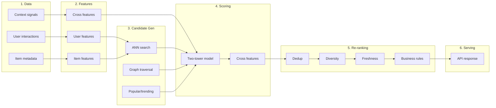

# 09 — Recommendation Systems: From Zero to Production

A complete guide to how recommendation systems work — from raw data to serving results. This is your backbone for understanding the foundations to intermediate level of what industry-leading teams build.

---

## Table of Contents

1. [What Is a Recommendation System?](#1-what-is-a-recommendation-system)
2. [The 3 Fundamental Approaches](#2-the-3-fundamental-approaches)
3. [The Production Pipeline](#3-the-production-pipeline)
4. [Data Collection and Signals](#4-data-collection-and-signals)
5. [Feature Engineering](#5-feature-engineering)
6. [Embeddings and Vector Search](#6-embeddings-and-vector-search)
7. [Candidate Generation](#7-candidate-generation)
8. [Scoring and Ranking](#8-scoring-and-ranking)
9. [Re-ranking and Post-Processing](#9-re-ranking-and-post-processing)
10. [Graph-Based Recommendations](#10-graph-based-recommendations)
11. [Evaluation Metrics](#11-evaluation-metrics)
12. [Serving and Latency](#12-serving-and-latency)
13. [Architecture Patterns](#13-architecture-patterns)
14. [Micro-Decisions and Alternatives](#14-micro-decisions-and-alternatives)
15. [Learning Resources and Repos](#15-learning-resources-and-repos)

---

## 1. What Is a Recommendation System?

A system that predicts what a user wants to see next, given what they have seen before.

**The problem:** You have millions of items (repos, songs, videos). A user looks at one. You need to show them the most relevant others — in under 150ms.

**The solution:** A pipeline that narrows millions to hundreds to ranked list to final output.

```
millions of items --> narrow to hundreds --> rank them --> show top N
   (recall)              (precision)          (quality)
```

This is the same pattern used by YouTube, Spotify, Pinterest, TikTok, and Netflix. The algorithms differ, but the funnel is identical.

---

## 2. The 3 Fundamental Approaches

### 2.1 Content-Based Filtering

**Idea:** "You liked this item. Here are items with similar content."

```
user likes item A
    |
    v
find items with similar features (text, tags, metadata)
    |
    v
recommend items B, C, D
```

**How it works:**
- Each item has features (description, tags, categories)
- Compute similarity between items using these features
- Recommend the most similar items

**Formula — Cosine Similarity:**

```
similarity(A, B) = (A dot B) / (||A|| x ||B||)

Where:
  A dot B = sum of (A_i x B_i) for all dimensions
  ||A|| = sqrt(sum of A_i squared)
```

**Intuition:** Two items are similar if their feature vectors point in the same direction. The angle between them tells you how similar they are.

**Pros:** Works for new items (cold-start), no user data needed, explainable
**Cons:** Only finds "more of the same", misses serendipity, limited by feature quality

---

### 2.2 Collaborative Filtering

**Idea:** "Users like you also liked these items."

```
user A likes items 1, 2, 3
user B likes items 1, 2, 4
    |
    v
A and B are similar (they share items 1 and 2)
    |
    v
recommend item 4 to user A (B liked it, A has not seen it)
```

**Types:**

| Type | How it works |
|---|---|
| **User-based** | Find similar users, recommend what they liked |
| **Item-based** | Find similar items based on co-occurrence |
| **Matrix Factorization** | Decompose user-item matrix into latent factors |

**Formula — Matrix Factorization (SVD):**

```
User-Item matrix R is approximately U x V_transpose

Where:
  U = user factors (each user is a vector of latent features)
  V = item factors (each item is a vector of latent features)
  R_ij is approximately U_i dot V_j (dot product predicts rating)

Prediction for user u, item i:
  r_hat_ui = mu + b_u + b_i + U_u dot V_i

Where:
  mu = global average rating
  b_u = user bias (some users rate higher)
  b_i = item bias (some items are rated higher)
```

**Intuition:** Every user and item gets a hidden vector of 50-200 numbers. These numbers capture latent patterns (e.g., "likes JavaScript", "prefers small libraries"). The dot product of a user vector and item vector predicts how much the user will like the item.

**Pros:** No content features needed, finds serendipitous recommendations
**Cons:** Cold-start problem (new users/items), needs lots of interaction data

---

### 2.3 Hybrid Approaches

**Idea:** Combine content-based and collaborative filtering.

```
content-based score --+
                      +--> weighted combination --> final score
collaborative score --+
```

**Common hybrid strategies:**

| Strategy | How |
|---|---|
| **Weighted** | `score = alpha x content_score + (1-alpha) x collab_score` |
| **Switching** | Use content-based for new items, collaborative for established ones |
| **Feature augmentation** | Use one approach's output as input to the other |
| **Ensemble** | Train both models, combine predictions with a meta-learner |

**RepoRelay uses a hybrid:** Content (README embeddings) + Graph (dependency patterns) + Behavioral (co-stars, co-contributors).

---

## 3. The Production Pipeline

This is how every major recommendation system works in production.

### Mermaid



### ASCII

```
 +---------------------------------------------------------------+
 |  1. DATA COLLECTION                                            |
 |  +--------------+  +--------------+  +--------------+          |
 |  | User actions |  | Item metadata|  | Context      |          |
 |  | (clicks,     |  | (text, tags, |  | (time,       |          |
 |  |  stars, views|  |  description)|  |  device)     |          |
 |  +------+-------+  +------+-------+  +------+-------+          |
 +---------+------------------+------------------+----------------+
           |                  |                  |
           v                  v                  v
 +---------------------------------------------------------------+
 |  2. FEATURE ENGINEERING                                        |
 |  +--------------+  +--------------+  +--------------+          |
 |  | User features|  | Item features|  | Cross features|         |
 |  | (history,    |  | (embeddings, |  | (dep overlap, |         |
 |  |  preferences)|  |  graph edges)|  |  co-stars)    |         |
 |  +------+-------+  +------+-------+  +------+-------+          |
 +---------+------------------+------------------+----------------+
           |                  |                  |
           v                  v                  v
 +---------------------------------------------------------------+
 |  3. CANDIDATE GENERATION (narrow millions to hundreds)        |
 |  +--------------+  +--------------+  +--------------+          |
 |  | ANN search   |  | Graph        |  | Popular/     |          |
 |  | (semantic    |  | traversal    |  | trending     |          |
 |  |  similarity) |  | (neighbors)  |  | (baseline)   |          |
 |  +------+-------+  +------+-------+  +------+-------+          |
 +---------+------------------+------------------+----------------+
           |                  |                  |
           +------------------+------------------+
                              v
 +---------------------------------------------------------------+
 |  4. SCORING (rank hundreds to ordered list)                    |
 |  +------------------------------------------------------+    |
 |  | Two-Tower Model + Cross Features                      |    |
 |  | repo_tower(repo) dot user_tower(user) + cross_features|    |
 |  +---------------------------+----------------------------+    |
 +-----------------------------+----------------------------------+
                               |
                               v
 +---------------------------------------------------------------+
 |  5. RE-RANKING (apply hard constraints)                        |
 |  +----------+ +----------+ +----------+ +----------+          |
 |  | Dedup    | | Diversity| | Freshness| | Business |          |
 |  |          | |          | | boost    | | rules    |          |
 |  +----------+ +----------+ +----------+ +----------+          |
 +-----------------------------+----------------------------------+
                               |
                               v
 +---------------------------------------------------------------+
 |  6. SERVING                                                    |
 |  API returns ranked list in less than 150ms                    |
 +---------------------------------------------------------------+
```

---

## 4. Data Collection and Signals

### What data do you need?

| Signal type | Examples | What it tells you |
|---|---|---|
| **Explicit** | Ratings, likes, upvotes | Direct preference |
| **Implicit** | Clicks, views, time spent, purchases | Inferred preference |
| **Content** | Text, tags, categories, metadata | What the item is about |
| **Graph** | Dependencies, co-occurrence, social connections | How items relate to each other |
| **Temporal** | When interactions happened | Trends, freshness, decay |

### Signal quality hierarchy

```
strongest ------------------------------------------- weakest

purchase > add-to-cart > click > view > impression
star > fork > watch > scroll
```

**Key insight:** Not all signals are equal. A star is stronger than a view. A fork is stronger than a star. Weight your signals accordingly.

---

## 5. Feature Engineering

### User features

| Feature | What it captures |
|---|---|
| Interaction history | What they have liked before |
| Embedding of past items | Their taste as a vector |
| Activity level | Power user vs casual |
| Recency | How recently they were active |

### Item features

| Feature | What it captures |
|---|---|
| Text embedding | What the item is about |
| Metadata (tags, category) | Structured attributes |
| Popularity | How many people interact with it |
| Freshness | How new it is |
| Graph embedding | Its position in the relationship graph |

### Cross features (item-item or user-item)

| Feature | What it captures |
|---|---|
| Co-occurrence count | How often two items appear together |
| Dep overlap | How many shared dependencies |
| Temporal co-activity | Were they used at the same time? |

---

## 6. Embeddings and Vector Search

### What is an embedding?

A way to convert unstructured data (text, images) into a fixed-size list of numbers that captures meaning.

```
"A fast JavaScript bundler for modern web apps"
    |
    v embedding model
[0.23, -0.87, 0.45, 0.12, -0.34, ...]  (768 numbers)
```

Two texts about similar topics produce similar vectors.

### Embedding models for text

| Model | Dimensions | Speed | Quality |
|---|---|---|---|
| sentence-transformers (all-MiniLM-L6-v2) | 384 | Fast | Good |
| OpenAI text-embedding-3-small | 1536 | API call | Great |
| OpenAI text-embedding-3-large | 3072 | API call | Best |
| Cohere embed-v3 | 1024 | API call | Great |
| Custom trained | Varies | Varies | Domain-specific |

### Vector search — how it works

**Brute force (exact):**
```
query vector Q, database vectors V1, V2, ... Vn
for each Vi:
    compute distance(Q, Vi)
return top K closest
```

Problem: O(n) — too slow for millions of items.

**ANN (Approximate Nearest Neighbor):**
```
build index (HNSW, IVF, etc.)
    |
    v
query: find ~100 closest vectors in O(log n)
    |
    v
return approximate results (95%+ recall)
```

**Distance metrics:**

| Metric | Formula | When to use |
|---|---|---|
| Cosine | `1 - (A dot B / (norm_A x norm_B))` | When direction matters, not magnitude |
| Euclidean | `sqrt(sum((A_i - B_i)^2))` | When magnitude matters |
| Dot product | `-(A dot B)` | When vectors are normalized |

### Vector databases

| Database | Type | Best for |
|---|---|---|
| pgvector (Postgres extension) | Self-hosted | Simple, already using Postgres |
| Pinecone | Managed | No ops, scales easily |
| Weaviate | Self-hosted/managed | Rich filtering |
| Qdrant | Self-hosted/managed | Performance |
| Milvus | Self-hosted | Massive scale |

---

## 7. Candidate Generation

Goal: Narrow millions of items to ~100-500 candidates. Fast. Do not miss good ones.

### Technique 1: ANN on embeddings

```
query: "next.js"
    |
    v
embed query
    |
    v
ANN search in vector DB
    |
    v
top 200 semantically similar repos
```

**Pros:** Captures semantic similarity, works for new items
**Cons:** Misses graph-based relationships

### Technique 2: Graph traversal

```
start at "next.js"
    |
    v
walk 1-hop neighbors (repos it depends on, repos that depend on it)
    |
    v
walk 2-hop neighbors (neighbors of neighbors)
    |
    v
collect ~200 graph-proximate repos
```

**Pros:** Captures ecosystem relationships, cold-start resistant
**Cons:** Limited to known graph structure

### Technique 3: Co-occurrence / popular

```
"trending in JavaScript"
    |
    v
query popular repos by topic + time weight
    |
    v
top 100 trending JS repos
```

### Combining candidates

```
ANN results ----------+
                      |
graph results --------+--> union + dedup --> ~300-500 candidates
                      |
popular/trending -----+
```

---

## 8. Scoring and Ranking

Goal: Take ~300-500 candidates and rank them by relevance to this specific (user, item) pair.

### Two-Tower Model

The most common architecture in production recommendation systems.

```
+--------------+     +--------------+
|  User Tower  |     |  Item Tower  |
|              |     |              |
|  user_id ----+     +---- item_id  |
|  history ----+     +---- text     |
|  features ---+     +---- features |
|      |       |     |      |       |
|      v       |     |      v       |
|  user_vec    |     |  item_vec    |
|  (128 dims)  |     |  (128 dims)  |
+------+-------+     +------+-------+
       |                    |
       +--------+-----------+
                |
                v
         dot product
                |
                v
         relevance score
```

**Formula:**

```
score(user, item) = user_vector dot item_vector

Where:
  user_vector = user_tower(user_features)   # shape: (128,)
  item_vector = item_tower(item_features)   # shape: (128,)
  dot product = sum(user_vector_i x item_vector_i)
```

**Intuition:** The user tower compresses everything about the user into a 128-number vector. The item tower does the same for the item. If their vectors point in the same direction (high dot product), the user will like the item.

**Training:**

```
positive pair (user liked item):    score should be HIGH
negative pair (user did not like):  score should be LOW

loss = -log(sigmoid(score_positive - score_negative))
```

This is called **BPR loss** (Bayesian Personalized Ranking) or **contrastive loss**.

### Cross Features

The two-tower model cannot see how user and item features interact (each tower is independent). Cross features fix this.

```
two-tower score -------------------+
                                    |
cross features:                     +--> final score
  dep_overlap_count ----------------+
  co_star_count --------------------+
  days_since_last_activity ---------+
```

**Why both?**
- Two-tower: fast at serving (precompute item vectors, only compute user vector at request time)
- Cross features: accurate (capture explicit interactions the towers cannot see)
- Hybrid: fast AND accurate

---

## 9. Re-ranking and Post-Processing

Goal: Take the model's ranked list and apply hard constraints. No ML here — just rules.

### Common re-ranking steps

```
model output (ranked list)
    |
    v
1. Deduplication
   remove duplicate items across slots
    |
    v
2. Filter
   remove NSFW, archived, low-quality items
    |
    v
3. Freshness boost
   bump recently created/updated items
    |
    v
4. Diversity
   do not show 5 items from the same category
    |
    v
5. Business rules
   slot quotas, sponsorship, legal
    |
    v
final output
```

### Why re-ranking matters

The model optimizes for relevance. But relevance alone is not enough:
- You need diversity (not 10 React UI libs)
- You need freshness (not all 5-year-old projects)
- You need quality (not abandoned repos)
- You need business rules (no NSFW, slot quotas)

Re-ranking is cheap (no ML) and has huge quality impact.

---

## 10. Graph-Based Recommendations

Graph-based recommendations use the **relationship structure** between items, users, and attributes — not just content similarity.

### When graphs shine

| Scenario | Why graph helps |
|---|---|
| New item with no interactions | Still connected to other items via deps/topics |
| Ecosystem neighbors | Dep graph captures "lives next to" relationships |
| Cross-recommendations | Workflow co-usage crosses ecosystem boundaries |

### Graph algorithms for recommendations

| Algorithm | What it does | Use case |
|---|---|---|
| **BFS/DFS traversal** | Walk N hops from a node | Find neighbors |
| **PageRank** | Rank nodes by importance | Find influential repos |
| **Node2Vec** | Learn node embeddings from walks | ANN on graph structure |
| **Graph Neural Networks (GNNs)** | Learn embeddings by aggregating neighbor info | State-of-the-art graph recs |

### Node2Vec intuition

```
1. Do random walks on the graph starting from each node
2. Collect sequences of visited nodes: A -> B -> C -> D
3. Treat these sequences like sentences
4. Apply Word2Vec (Skip-gram) to learn embeddings

Result: nodes that appear in similar walks get similar embeddings
```

**Formula — Skip-gram objective:**

```
maximize: sum of log(P(neighbor | center_node))

P(neighbor | center) = softmax(embedding_neighbor dot embedding_center)
```

**Intuition:** If two nodes appear in similar walks (they have similar neighborhoods), they get similar embeddings. This captures the graph structure in a vector.

---

## 11. Evaluation Metrics

### Offline metrics (before deployment)

| Metric | Formula | What it measures |
|---|---|---|
| **Precision@K** | (relevant in top K) / K | How many of the top K are relevant |
| **Recall@K** | (relevant in top K) / (total relevant) | How many of all relevant items made it to top K |
| **NDCG@K** | DCG@K / IDCG@K | Are relevant items ranked highly (not just present)? |
| **MAP** | Average precision across queries | Overall ranking quality |
| **MRR** | 1 / rank of first relevant item | How quickly the user finds something good |

### NDCG explained

```
DCG@K = sum(rel_i / log2(i + 1))  for i = 1 to K

Where:
  rel_i = relevance of item at position i
  log2(i + 1) = discount factor (position 1 counts more than position 10)

NDCG@K = DCG@K / IDCG@K

IDCG = ideal DCG (if perfectly ranked)
NDCG ranges from 0 to 1 (1 = perfect ranking)
```

**Intuition:** NDCG rewards putting relevant items at the TOP of the list, not just including them somewhere. A relevant item at position 1 is worth more than at position 10.

### Online metrics (after deployment)

| Metric | What it measures |
|---|---|
| **CTR** | Click-through rate — did users click the recommendation? |
| **Dwell time** | How long did they spend on the clicked item? |
| **Conversion** | Did they star, fork, or install? |
| **Return rate** | Did they come back for more? |

### Offline vs online

```
Offline: "On a test set, the model ranks relevant items highly"
Online:  "Real users actually click and engage with the recommendations"

Offline metrics do not always predict online performance.
Always validate with A/B testing.
```

---

## 12. Serving and Latency

### Latency budget breakdown

```
total: 150ms p99
+-- feature fetch:        20ms
+-- ANN candidate gen:    30ms
+-- graph traversal:      30ms
+-- two-tower scoring:    40ms
+-- cross-feature lookup: 15ms
+-- rerank + serialize:   15ms
```

### How to stay fast

| Technique | What it does |
|---|---|
| **Precompute item vectors** | ANN search only needs to compute the user vector at request time |
| **Cache feature lookups** | Redis for hot features (popular repos) |
| **Approximate algorithms** | ANN instead of exact KNN, saves 10x time |
| **Batch scoring** | Score multiple candidates in one GPU call |
| **Edge computing** | Serve from the region closest to the user |

### Two-phase serving

```
Phase 1 (offline, async):
  - Precompute all item vectors
  - Precompute graph embeddings
  - Store in vector DB + feature store

Phase 2 (online, sync):
  - Compute user vector (fast, only one vector)
  - ANN search (fast, uses precomputed index)
  - Score candidates (fast, batched dot products)
  - Re-rank (cheap, no ML)
```

---

## 13. Architecture Patterns

### Pattern 1: Lambda Architecture (batch + stream)

```
raw data --+--> batch pipeline (daily) ----> batch views
           |
           +--> stream pipeline (real-time) -> real-time views
                                                    |
                                                    +--> merge --> serving
```

**Pros:** Handles both historical and real-time data
**Cons:** Two codebases to maintain

### Pattern 2: Kappa Architecture (stream only)

```
raw data --> stream pipeline --> materialized views --> serving
```

**Pros:** Single codebase, simpler
**Cons:** Replay is expensive for large historical data

### Pattern 3: Feature Store pattern (what RepoRelay uses)

```
offline pipeline --> feature store --> online serving
                       ^
                       |
                  offline training
```

**Pros:** Clean separation of offline and online
**Cons:** Feature store is a critical dependency

### Which pattern for RepoRelay?

The Feature Store pattern. The offline pipeline precomputes everything (embeddings, graph edges, co-star patterns). The online serving API just reads from the feature store and runs the lightweight scoring + re-ranking.

---

## 14. Micro-Decisions and Alternatives

### Embedding model choice

| Option | Pros | Cons | When to use |
|---|---|---|---|
| sentence-transformers | Free, fast, self-hosted | Lower quality than API models | MVP, cost-sensitive |
| OpenAI embedding API | High quality | API cost, latency | Production, quality-first |
| Cohere embed | Great multilingual | API cost | Multi-language items |
| Custom trained | Domain-specific | Needs training data, effort | Large scale, niche domain |

### Vector DB choice

| Option | Pros | Cons | When to use |
|---|---|---|---|
| pgvector | Already using Postgres, simple | Slower at scale | MVP, small catalog |
| Pinecone | Managed, no ops | Vendor lock-in, cost | Production, fast growth |
| Qdrant | Fast, open source | Self-hosted ops | Performance-critical |
| Weaviate | Rich filtering, hybrid search | Complexity | Complex query needs |

### Candidate generation approach

| Option | Pros | Cons | When to use |
|---|---|---|---|
| ANN only | Simple, fast | Misses graph relationships | Content-heavy domains |
| Graph only | Captures ecosystem | Cold-start for isolated nodes | Graph-rich domains |
| ANN + Graph | Best of both | More complexity | Production (what RepoRelay uses) |

### Scoring model choice

| Option | Pros | Cons | When to use |
|---|---|---|---|
| Logistic regression | Simple, interpretable | Limited expressiveness | Baseline, simple domains |
| Two-tower | Fast serving, scalable | Cannot model cross-features alone | Large catalog, production |
| DeepFM | Captures feature interactions | Slower serving | Feature-rich domains |
| Two-tower + cross features | Fast AND accurate | More engineering | Production (what RepoRelay uses) |

### Framework choices

| Framework | Language | Best for |
|---|---|---|
| RecBole | Python | Research, trying many algorithms |
| PyTorch / TensorFlow | Python | Custom model development |
| LightFM | Python | Hybrid (content + collaborative) |
| Surprise | Python | Classic collaborative filtering |
| implicit | Python | Implicit feedback data |
| Merlin (NVIDIA) | Python | End-to-end GPU-accelerated |

---

## 15. Learning Resources and Repos

### Start here (fundamentals)

| Resource | What you learn | Time |
|---|---|---|
| "Recommendation Systems Explained" (YouTube, any 20-30 min video) | The 3 approaches, basic intuition | 30 min |
| Google's "Rule of 5" (blog post) | How production systems actually work | 15 min |
| RecBole getting started guide | Try algorithms hands-on | 2 hours |

### Go deeper (intermediate)

| Resource | What you learn |
|---|---|
| "Deep Learning based Recommender System" (survey paper) | All modern architectures |
| Pinterest's "Homefeed" engineering blog | Real-world two-tower at scale |
| YouTube's "Deep Neural Networks for YouTube Recommendations" (paper) | The original two-tower for rec systems |
| Spotify's "Explore, Exploit, and Explain" (blog) | Personalization at scale |
| Google's "Sampling-Bias-Corrected Neural Modeling" (paper) | Two-tower training done right |

### Repos to study

| Repo | What it teaches |
|---|---|
| [RecBole/RecBole](https://github.com/RUCAIBox/RecBole) | 90+ recommendation algorithms in one framework |
| [microsoft/recommenders](https://github.com/microsoft/recommenders) | Production patterns from Microsoft |
| [lyst/lightfm](https://github.com/lyst/lightfm) | Hybrid recommendations (content + collaborative) |
| [benfred/implicit](https://github.com/benfred/implicit) | Collaborative filtering for implicit feedback |
| [spotify/annoy](https://github.com/spotify/annoy) | ANN library for vector search |
| [hnswlib](https://github.com/nmslib/hnswlib) | Fast ANN indexing |
| [pgvector/pgvector](https://github.com/pgvector/pgvector) | Vector search in Postgres |

### Learning path (what to do in order)

```
1. Watch a 30-min intro video on YouTube
   --> understand content-based vs collaborative vs hybrid

2. Run RecBole on a small dataset
   --> see how algorithms work in code

3. Read the Pinterest engineering blog
   --> understand how production systems are structured

4. Read the YouTube DNN paper
   --> understand the two-tower model deeply

5. Implement candidate generation (ANN search)
   --> first real piece of a recommendation system

6. Implement scoring (two-tower or LightFM)
   --> now you have a working pipeline

7. Add re-ranking rules
   --> now you have a production-quality system
```

---

## Summary: What RepoRelay Uses

| Pipeline stage | What RepoRelay does |
|---|---|
| **Data signals** | README embeddings, dep graph, co-stars, co-contributors, workflows |
| **Candidate generation** | ANN on embeddings + graph traversal |
| **Scoring** | Two-tower model + cross features |
| **Re-ranking** | Dedup, freshness, diversity, business rules |
| **Serving** | FastAPI, target less than 150ms p99 |
| **Storage** | Postgres + pgvector + Apache AGE |

This is a standard, production-quality architecture used by YouTube, Pinterest, and Spotify. The funnel (narrow, score, re-rank) is the same. The signals and models differ per domain.
